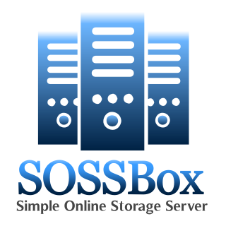

## NEW PROJECT
This is a new project under active development and changing frequently. Documentation for use is not yet available will come soon. It may be possible to use a SOSSBox server after looking at the `sossbox.cfg` file for static hosting, however the routes of the REST API are not documented (but can be found in the `routes.js` file).

To start the server without yarn:
```
node server.js
```

To initialize the development environment (dependencies):
```
yarn
```
To start the server (with yarn):
```
yarn start
```
